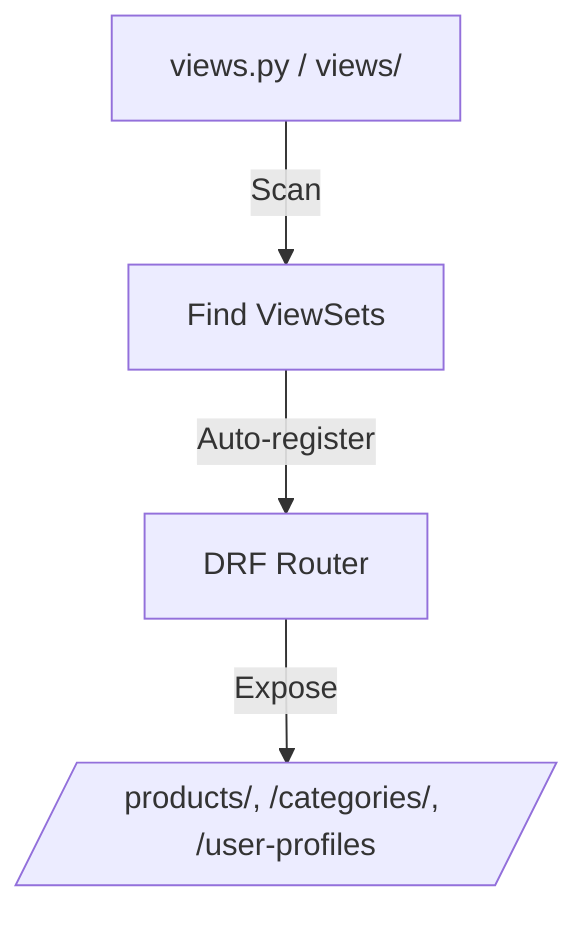

# 🚀 Auto ViewSet Router for Django REST Framework

Convention-based auto-discovery and registration of all ViewSets in your app’s views module/package with a DRF Router. Enforces RESTful, plural, kebab-case routes and eliminates boilerplate.

---

## 📂 Location

`components/router/routers.py`

---

## ✨ Features

- 🔍 Auto-discovers ViewSets in `views.py` or `views/` package
- 🚦 Registers with plural, kebab-case routes
- 🏷️ Supports custom route names (`route_name`)
- 🪄 Prefix support for modular APIs
- 🔡 Switch between kebab-case (default) and snake_case
- 📦 Honors `__all__` for selective registration

---

## 🖼️ Visual Example



---

## 🛠️ Usage

```python
from django.urls import include, path
from rest_framework.routers import DefaultRouter
from apps.accounts import views
from components.router.routers import auto_register_viewsets

router = DefaultRouter()
auto_register_viewsets(router, views)

urlpatterns = [
    path("", include(router.urls)),
]
```

---

## 🏷️ ViewSet Examples

```python
class ProductViewSet(ViewSet): pass      # → /products/
class CategoryViewSet(ViewSet): pass     # → /categories/
class UserProfileViewSet(ViewSet): pass  # → /user-profiles/
class AuthViewSet(ViewSet):
    route_name = "auth"                  # → /auth/
```

---

## 🪄 Prefix & Case Style

```python
auto_register_viewsets(router, views, prefix="accounts")
# DeviceViewSet → /accounts-devices/

auto_register_viewsets(router, views, case_style="snake")
# /user_profiles/
```

---

## 📐 Route Naming Rules

| Rule                | Example Class         | Resulting Route         |
|---------------------|----------------------|------------------------|
| Default             | `ProductViewSet`     | `/products/`           |
| Pluralization       | `CategoryViewSet`    | `/categories/`         |
|                     | `BoxViewSet`         | `/boxes/`              |
|                     | `ClassViewSet`       | `/classes/`            |
|                     | `BrushViewSet`       | `/brushes/`            |
| Multi-word          | `UserProfileViewSet` | `/user-profiles/`      |
| Custom Override     | `AuthViewSet`        | `/auth/`               |

- **Ends in `y`**: replace with `ies` (_Category → categories_)
- **Ends in `x, s, sh, ch`**: add `es` (_Box → boxes, Class → classes, Brush → brushes_)
- **Multi-word**: kebab-case, pluralize last word (_UserProfileViewSet → /user-profiles/_)
- **Default**: append `s` (_Company → companies_)
- **Custom**: set `route_name = "<custom>"` in the ViewSet

---

## 🧩 Example Project Layout

```plaintext
apps/
  accounts/
    views.py           # auto-discovered
    views/
      auth.py
      users.py         # auto-discovered
components/
  router/
    routers.py         # auto router lives here
AUTO_ROUTER.md         # this documentation
```

---

## ✅ Best Practices

- Prefer **kebab-case** for URLs (`/user-profiles/`)
- Keep ViewSet names **singular** (`ProductViewSet`)
- Use `route_name` only for exceptions (e.g. `/auth/`)
- Add this doc to onboarding for team consistency

