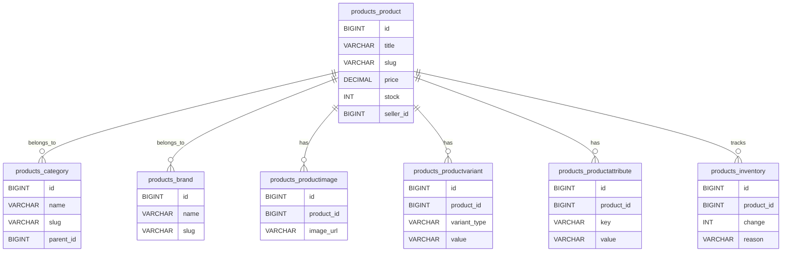
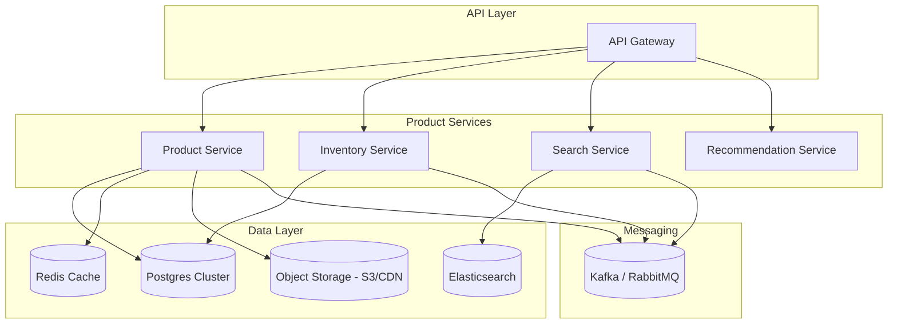

# 🛍️ Products Service Design (LLD + HLD)

---

## 🧩 Low-Level Design (LLD) – Database Schema

This focuses on **tables, fields, constraints, and relationships**.

---

### 1. Product Table

**Table:** `products_product`

| Column          | Type                              | Constraints       |
| --------------- | --------------------------------- | ----------------- |
| id              | UUID / BIGINT AUTO INCREMENT (PK) | Sharding key      |
| title           | VARCHAR(255)                      | NOT NULL, Indexed |
| slug            | VARCHAR(255)                      | Unique, Indexed   |
| description     | TEXT                              | Full-text index   |
| sku             | VARCHAR(100)                      | Unique, Indexed   |
| price           | DECIMAL(12,2)                     | NOT NULL          |
| discount\_price | DECIMAL(12,2)                     | NULL              |
| currency        | CHAR(3)                           | Default = 'USD'   |
| stock           | INT                               | NOT NULL          |
| is\_active      | BOOLEAN                           | Default = TRUE    |
| rating          | FLOAT                             | Default = 0.0     |
| review\_count   | INT                               | Default = 0       |
| seller\_id      | FK → accounts\_user               | Indexed           |
| category\_id    | FK → products\_category           | Indexed           |
| brand\_id       | FK → products\_brand              | Nullable, Indexed |
| created\_at     | TIMESTAMP                         | Indexed           |
| updated\_at     | TIMESTAMP                         |                   |

---

### 2. Category Table

**Table:** `products_category`

| Column      | Type                    | Constraints       |
| ----------- | ----------------------- | ----------------- |
| id          | BIGINT (PK)             |                   |
| name        | VARCHAR(255)            | NOT NULL          |
| slug        | VARCHAR(255)            | Unique, Indexed   |
| parent\_id  | FK → products\_category | Nullable, Indexed |
| created\_at | TIMESTAMP               |                   |
| updated\_at | TIMESTAMP               |                   |

---

### 3. Brand Table

**Table:** `products_brand`

| Column      | Type         | Constraints      |
| ----------- | ------------ | ---------------- |
| id          | BIGINT (PK)  |                  |
| name        | VARCHAR(255) | Unique, NOT NULL |
| slug        | VARCHAR(255) | Unique, Indexed  |
| logo        | VARCHAR(500) | Image URL        |
| created\_at | TIMESTAMP    |                  |
| updated\_at | TIMESTAMP    |                  |

---

### 4. Product Images Table

**Table:** `products_productimage`

| Column      | Type                   | Constraints                |
| ----------- | ---------------------- | -------------------------- |
| id          | BIGINT (PK)            |                            |
| product\_id | FK → products\_product | Indexed, ON DELETE CASCADE |
| image\_url  | VARCHAR(500)           | NOT NULL                   |
| alt\_text   | VARCHAR(255)           |                            |
| position    | INT                    | Default = 0                |
| created\_at | TIMESTAMP              |                            |

---

### 5. Product Variants (Size, Color, etc.)

**Table:** `products_productvariant`

| Column          | Type                                     | Constraints                |
| --------------- | ---------------------------------------- | -------------------------- |
| id              | BIGINT (PK)                              |                            |
| product\_id     | FK → products\_product                   | Indexed, ON DELETE CASCADE |
| variant\_type   | ENUM['size','color','material','custom'] |                            |
| value           | VARCHAR(100)                             | NOT NULL                   |
| price\_override | DECIMAL(12,2)                            | NULL                       |
| stock           | INT                                      | NOT NULL                   |
| sku             | VARCHAR(100)                             | Unique, Indexed            |
| created\_at     | TIMESTAMP                                |                            |
| updated\_at     | TIMESTAMP                                |                            |

---

### 6. Product Attributes (Dynamic key-value pairs)

**Table:** `products_productattribute`

| Column      | Type                   | Constraints                |
| ----------- | ---------------------- | -------------------------- |
| id          | BIGINT (PK)            |                            |
| product\_id | FK → products\_product | Indexed, ON DELETE CASCADE |
| key         | VARCHAR(100)           | Indexed                    |
| value       | VARCHAR(255)           |                            |

---

### 7. Inventory / Stock Movement

**Table:** `products_inventory`

| Column        | Type                                          | Constraints          |
| ------------- | --------------------------------------------- | -------------------- |
| id            | BIGINT (PK)                                   |                      |
| product\_id   | FK → products\_product                        | Indexed              |
| change        | INT                                           | Positive / Negative  |
| reason        | ENUM['order','restock','return','adjustment'] |                      |
| reference\_id | UUID                                          | Order ID / reference |
| created\_at   | TIMESTAMP                                     |                      |

---

## 🏗 High-Level Design (HLD) – Products Service

This covers **scalability, partitioning, and technology choices**.

---

### 1. Data Storage Strategy

- **Primary DB:** PostgreSQL cluster (Citus / YugabyteDB) or MySQL (Vitess).
- **Sharding Key:** `product_id` or `seller_id` → distribute load.
- **Read Scaling:** Replicas for heavy product listing & search.
- **Write Scaling:** Sharded writes for product updates.

---

### 2. Search & Filtering

- **Engine:** Elasticsearch / OpenSearch.
- **Sync:** DB → Kafka → ES.
- **Indexed Fields:** title, description, attributes, category, price, stock.
- **Supports:** full-text search, faceted filtering.

---

### 3. Caching Layer

- **Store:** Redis / Memcached.
- **Cache Keys:**
  - `product:{id}`
  - `category:tree`
  - `products:trending`
- **TTL:** 1–24 hours.
- **Write-through caching:** updates propagate instantly.

---

### 4. Media / Images

- Store in **object storage** (AWS S3 / GCS / MinIO).
- Use **CDN** for global delivery.
- DB stores **URLs only** (not binary).

---

### 5. Event-Driven Architecture

- **Broker:** Kafka / RabbitMQ.
- **Events:**
  - Product stock updated → Inventory Service.
  - Product created → Search Service indexing.
  - Product inactive → Cache invalidation.

---

### 6. API & Microservices

- **Product Service:** CRUD, attributes, inventory.
- **Search Service:** Elasticsearch queries.
- **Inventory Service:** Stock management, order hooks.
- **Recommendation Service:** ML-based cross-sell, upsell.

---

### 7. Scalability Tactics

- **Partitioning:** `products_product` by `category_id` or `seller_id`.
- **Indexes:**
  - `(category_id, price)` → fast filtering.
  - `(seller_id, is_active)` → seller dashboards.
- **API Gateway + CDN:** global scale.
- **Workers:** background jobs for bulk imports/updates.

---

## 📊 Visual Design (Mermaid Diagrams)

### ERD – Products Module

### HLD – Products Microservices

---

✅ This `.md` file combines **LLD + HLD + ERD + Architecture Diagrams** for the Products Service. It will render beautifully in GitHub, GitLab, VS Code, or Obsidian.

